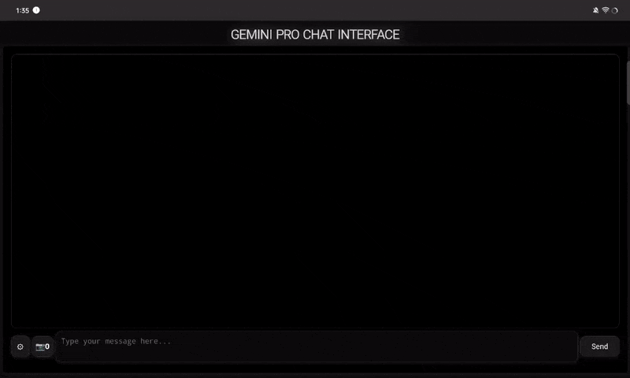

# Gemini Pro Chat Interface

Welcome to the GitHub repository for the Gemini Pro Chat Interface project. This application provides an elegant and intuitive chat interface for interacting with the Gemini Pro model.

## To-Do list

### Not finished
- a better implementation for sanitization (I really need some help with this)
- refactor CSS code
- refactor javascript code

### Finished
- chat sessions support (new)
- save chat to local storage support
- latex support
- markdown support
- images support
- regenerate butten support
- sanitize support
- copy and delete support

## Live Demo

Check out the live demo [here](https://geminihzhui.vercel.app/).

## Features

- Elegant and modern chat UI.
- Real-time interaction with the Gemini Pro model.
- Copy and delete messages functionalities.
- Responsive design for portrait screen orientation.
- KaTeX support for rendering mathematical expressions.
- Markdown support for formatted text.
- Local storage of API key for easy reuse.

## Screenshot



## Installation and Usage

To get started, clone this repository and open the `index.html` file in your preferred modern web browser.

```bash
git clone https://github.com/hihumanzone/gemini-pro-chat-interface.git
cd gemini-pro-chat-interface
# Open the index.html in your browser
```

Before using the chat interface, you need to enter your API key in the input field provided. The application allows you to clear chat history and start a new session as needed.

## Contributing

Contributions are welcome! Feel free to submit pull requests, create issues, or suggest improvements to the project.

## License

This project is licensed under the MIT License - see the [LICENSE.md](LICENSE.md) file for details.

## Author

This project is developed and maintained by **hihumanzone**. You can find more of my work at my [GitHub profile](https://github.com/hihumanzone).

## Acknowledgments

- Google Generative AI for providing the chat API.
- Vercel for hosting the live demo.
- KaTeX and Marked for rendering math and markdown content.

If you experience any issues or have any questions, please feel free to file an issue on GitHub. Enjoy interacting with your AI companions!
